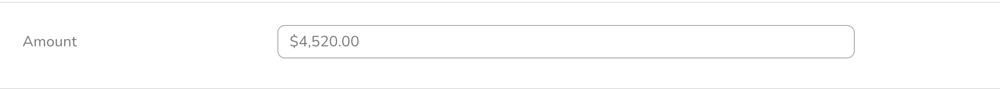
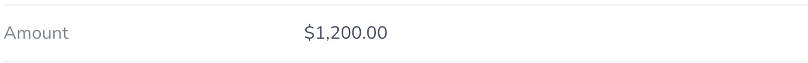

# Laravel Nova Currency Field

A laravel nova filed for currency input


## Installation

You can install the package in to a Laravel app that uses [Nova](https://nova.laravel.com) via composer:

```bash
composer require elyaash/currency-input
```

## Usage

In your resource class, add the following to your `fields` method:

```php
use Elyaash\CurrencyInput\CurrencyInput;

....

CurrencyInput::make("Field");
```

### How does it look?

Form View


Detail View:

Form View
